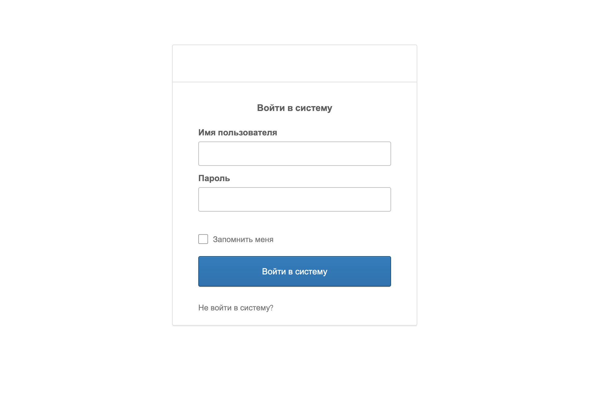
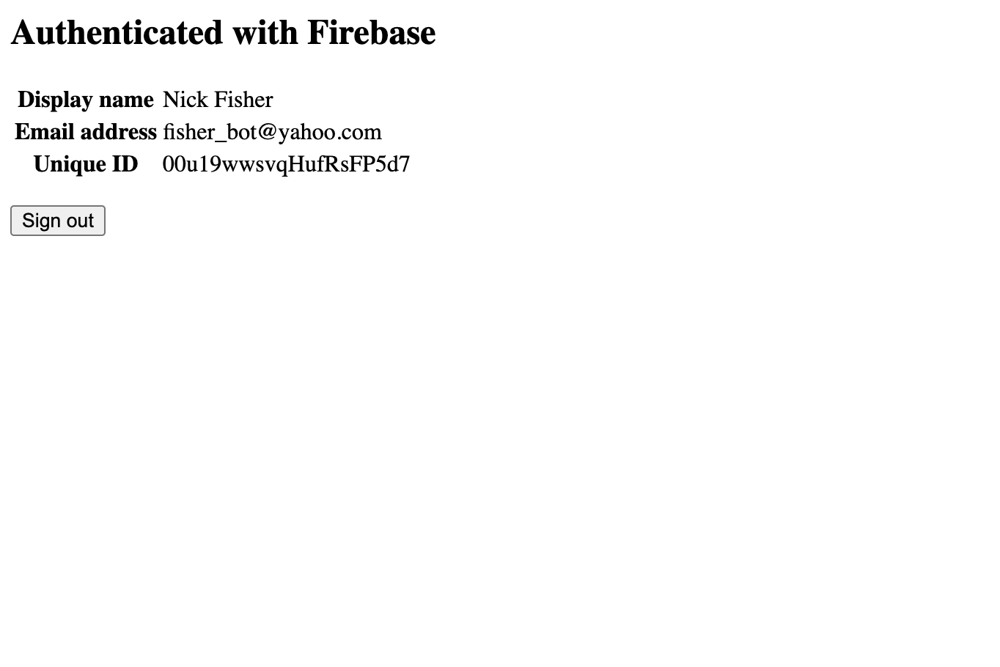

# What for?

This small repo helps to understand how to do integration with [Okta](https://developer.okta.com) and [Firebase](https://firebase.google.com). What processes exist in the app and how manage all of them. 

Note: hide credentials before deploy to production!

Make sure you have the following tools ready before you start working on a solution:

- node.js 12.x or newer
- npm or yarn

## Endpoints

Here is a route, that client uses to create custom token

`GET http://localhost:3000/firebaseCustomToken` - returns firebase token

## Develop

To run as dev, run the following:

1. `yarn` - install node modules
2. `yarn run dev` - run server.js with nodemon

or 

1. `npm i` - install node modules
2. `npm run dev` - run server.js with nodemon

## Process

1. Login with Okta credentials
2. Send oktaUid (jwt) to the `/firebaseCustomToken`
3. Generate firebaseToken
4. Auth client with firebase token

## Demo

Login page

Profile page

To login use your Okta credentials.
All admin/client credenttials have to be stored securely, use `.env` to hide them. 
For the testing purpose only.

[Preview](https://silent-snow-7174.fly.dev/)